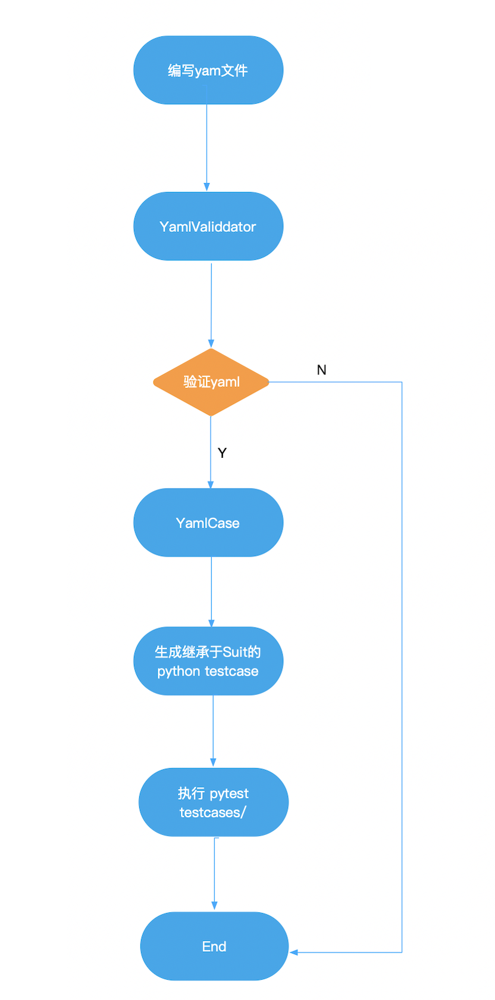
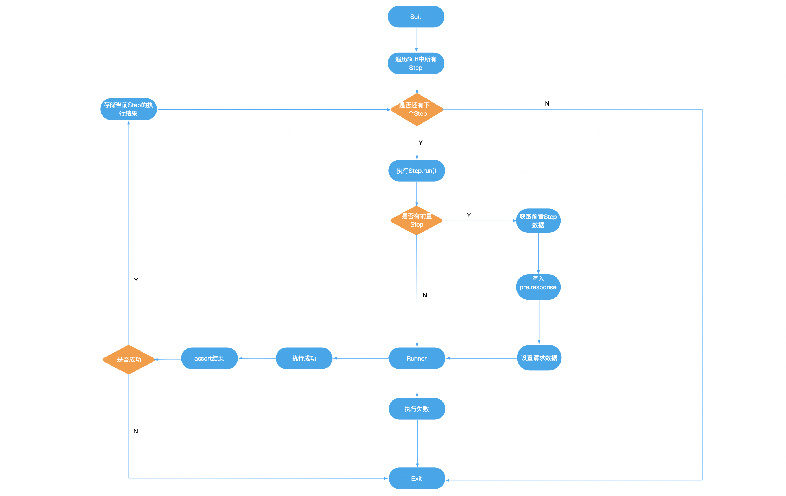

# simple auto-flow api testing scaffold

## Intro

一个用于API自动化测试的脚手架，使用Python编写


##  Why

###### 一开始其实选型HttpRunner用来做接口自动化，但在实践过程中发现有以下问题不能满需求

- 设置setup 和 teardown方法失效（缺少这个导致后面的流程无法开展）
- 单个用例的重试（目前httprunner未支持，pytest有插件）
- 在用例执行失败时，定义log输出信息，方便复现和debug（这个不是刚需，但是自己写可以完美支持）

###### 基于以上，需要一个简易的API测试脚手架，能够满足以下基础功能

- 通过yaml声明一条用例(Suit)
- 能够将yaml文件转换成python代码
- 支持`Step`间数据引用传递
- 支持`Step` 和 `Suit`级别的重试
## Quick Start

###### 1. 编写yaml

```yaml
global:
   host: "https://www.example.com"
   name: "Login"
   retry: 5
steps:
   - step:
      stepname: "getToken"
      request:
        pre: {}
        method: "POST"
        host: "https://auth.example.com"
        urlPath: "/token"
        data: {}
        header:
          User-Agent: ""
      response:
        code: 200
        error: "success"
   - step:
      stepname: "getDataList" 
      retry: 5
      request:
        pre: 
          - name: "getToken"
            addTo: 
              type: "Headers" # Body / Query / Url 
              location: "Authorization" # add to headers or request body
            refer:
              - name: "token"
                field: "token"
          - name: "getDataList"
            refer: 
              - name: "Id"
                field: "data.dataList.Id" # response data refer relationship
            addTo:
              type: "Query"
              location: "url"
        method: "POST"
        host: "https://example.com"
        urlPath: "/serach/{{getDataList.refer.Id}}/"
        data: None
        header:
          User-Agent: ""
      response:
        code: 200
        error: "success"
```

###### 2. 生成python代码

```python
python3 run setup.py [yaml_source_path] [python_output_path]
```


###### 3. 通过pytest执行生成的测试文件

```shell
pytest testcases/
```

## Overview 

#### 相关concept

- **Request**:    Request封装了http请求的常用方法，如`POST` , `GET`等，返回response.text
- **Step**:       一个Step描述的是一个API请求，用来管理Request对象，以及加上`retry`，`beforeRequest`, `afterRequest`等特性
- **Suit**:       一个Suit描述的是一条用例，由多个Step组成，存储Step执行后的结果，供其他Step使用。
<br>



<br>
<br>




## Feature

- [x] 支持yaml格式
- [x] 能够转成python 测试代码
- [x] 当前Step可以引用所在Case的前置Step的数据
- [ ] 支持全局变量，多Suit共享
- [ ] 支持报告
- [ ] 支持har格式
- [ ] 支持其他协议的接口  
- [ ] 支持locust


 
